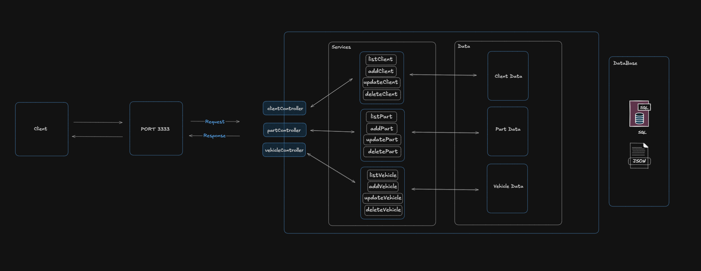

# Ponto 8 WebApp

## Descrição

Este projeto é uma aplicação web completa para gerenciamento de uma oficina, permitindo o cadastro e controle de clientes, veículos e peças. A aplicação é dividida em um backend construído com Node.js e TypeScript, e um frontend simples e intuitivo baseado em HTML, CSS e JavaScript puro (sua maioria gerado por IA).

## Tecnologias Utilizadas

### Backend

*   **Node.js**: Ambiente de execução JavaScript.
*   **Express.js**: Framework web para Node.js.
*   **TypeScript**: Linguagem de programação que adiciona tipagem estática ao JavaScript.
*   **PostgreSQL**: Sistema de gerenciamento de banco de dados relacional.

### Frontend

*   **HTML5**: Estrutura da aplicação web.
*   **CSS3**: Estilização da interface do usuário.
*   **JavaScript (ES6+)**: Lógica interativa do lado do cliente.

## Estrutura do Projeto

O projeto é organizado em duas pastas principais: `backend` e `frontend`.

```
ponto-8-webapp/
├── backend/
│   ├── arch/ (Diagramas de arquitetura)
│   ├── postgre/ (Scripts SQL para banco de dados)
│   ├── src/
│   │   ├── Models/ (Definições de modelos de dados)
│   │   ├── config/ (Configurações, ex: conexão com DB)
│   │   ├── controllers/ (Lógica de controle da API)
│   │   ├── repositories/ (Camada de acesso a dados)
│   │   ├── services/ (Lógica de negócio)
│   │   ├── routes.ts (Definição de rotas da API)
│   │   └── server.ts (Configuração e inicialização do servidor)
│   ├── package.json
│   └── tsconfig.json
├── frontend/
│   ├── css/ (Arquivos CSS)
│   ├── html/ (Arquivos HTML)
│   └── js/ (Arquivos JavaScript)
└── README.md
```

## Endpoints da API

A API fornece os seguintes endpoints para gerenciamento de clientes, veículos e peças:

### Clientes (`/clients`)

*   `GET /clients`: Lista todos os clientes.
*   `GET /clients/:name`: Filtra clientes pelo nome.
*   `POST /clients/post`: Cadastra um novo cliente.
*   `PATCH /clients/update/:id`: Atualiza um cliente existente pelo ID.
*   `DELETE /clients/:id`: Exclui um cliente pelo ID.

### Peças (`/parts`)

*   `GET /parts`: Lista todas as peças.
*   `GET /parts/:name`: Filtra peças pelo nome.
*   `POST /parts/post`: Cadastra uma nova peça.
*   `PATCH /parts/update/:id`: Atualiza uma peça existente pelo ID.
*   `DELETE /parts/:id`: Exclui uma peça pelo ID.

### Veículos (`/vehicle`)

*   `GET /vehicle`: Lista todos os veículos.
*   `GET /vehicle/:id`: Busca um veículo pelo ID.
*   `POST /vehicle/post`: Cadastra um novo veículo.
*   `PATCH /vehicle/update/:id`: Atualiza um veículo existente pelo ID.
*   `DELETE /vehicle/:id`: Exclui um veículo pelo ID.

## Funcionalidades

*   **Gerenciamento de Clientes**: Adicione, visualize, atualize e exclua informações de clientes.
*   **Gerenciamento de Veículos**: Associe veículos a clientes, e gerencie seus detalhes.
*   **Gerenciamento de Peças**: Controle o estoque de peças, incluindo valores de compra e venda.
*   **Interface Web Intuitiva**: Frontend para fácil interação com o sistema.

## Diagrama de Arquitetura

`.

*   `apresentation.png`
*   `structure.png`
