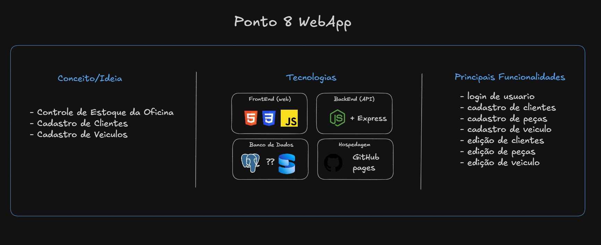
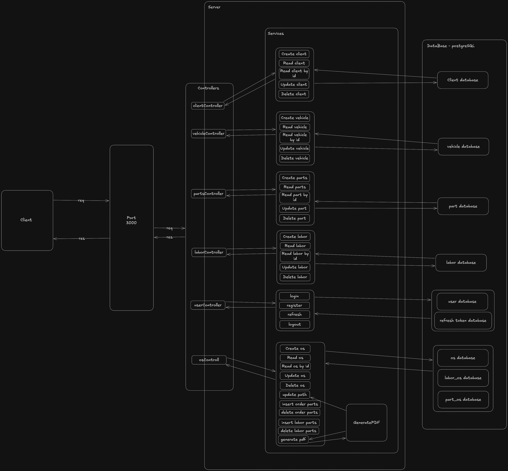

# Ponto 8 Web App - Documentação

Esse projeto é uma aplicação web completa para gerenciamento de oficinas mecânicas. A aplicação permite o cadastro e controle de clientes, veículos e peças, além da criação de Ordens de Serviço, criado sob medida para atender as necessidades da empresa atendida (Ponto 8 Motos).

---

## Funcionalidades Principais

O sistema é composto por 6 pilares principais: Gestão de Clientes (CRUD e CPF), Vínculo de Veículos, Controle de Estoque de Peças (com alerta de estoque crítico), Cadastro de Mão de Obra, Fluxo de Ordens de Serviço (com emissão de PDF) e Autenticação Segura via JWT & Refresh Tokens.

### Gestão de Clientes

Módulo responsável pelo gerenciamento completo do ciclo de vida dos clientes no sistema (operações de CRUD).

- Cadastro, visualização, atualização e exclusão de registros
- **Dados Armazenados:** informações pessoais, dados de contato e CPF

### Gestão de Veículos

Permite o vínculo direto entre os veículos e seus respectivos proprietários, garantindo o histórico de manutenções correto.

- Registro de veículos e associação dinâmica a um cliente cadastrado
- **Dados Armazenados:** Modelo, Marca, ano de fabricação/modelo, número do chassi e placa

### Gestão de Peças e Inventário

Controle automatizado do estoque da oficina para garantir a disponibilidade de insumos.

- Cadastro de peças, controle quantitativo e monitoramento de margem de lucro
- **Alertas:** Sistema inteligente de notificação visual ou relatórios para peças com estoque baixo, facilitando o processo de reposição
- **Dados Armazenados:** Nome da peça, quantidade em estoque, preço de custo e preço de venda

### Gestão de Serviços

Catálogo de serviços que serve como base de preço.

- Cadastro, edição e gerenciamento dos tipos de serviço (ex: alinhamento, troca de óleo, retífica)

### Gestão de Ordens de Serviço

O núcleo operacional do sistema, responsável por unificar todas as pontas do atendimento em um único registro documental.

- Criação, acompanhamento de status e fechamento das ordens de serviço
- **Vínculos:** associação direta a um cliente, um veículo, peças utilizadas e serviços de mão de obra prestados
- **Saídas:** geração automatizada de arquivos PDF detalhados da OS para impressão ou envio digital ao cliente

### Sistema de Autenticação e Segurança

Camada de segurança encarregada de proteger os dados da aplicação e garantir que apenas usuários autorizados acessem as funcionalidades.

- Registro de novos usuários e fluxo de login seguro
- **Tecnologia:** implementação de JWT (JSON Web Token) para autenticação stateless e mecanismo de Refresh Tokens, garantindo sessões seguras, persistentes e renováveis sem a necessidade de logins constantes

---

## Tecnologias Usadas

### Backend
<div align="left">
    
    
    
    
    
    
    
</div>

### Frontend
<div align="left">
    
    
    
    
    
</div>

---

## Estrutura do Projeto

```
ponto-8-webapp/
├── backend/
│   ├── arch/                  # Diagramas de arquitetura
│   ├── postgre/               # Scripts SQL para banco de dados
│   ├── src/
│   │   ├── Models/            # Definições de modelos de dados
│   │   ├── config/            # Configurações (ex: conexão com DB)
│   │   ├── controllers/       # Lógica de controle da API
│   │   ├── middlewares/       # Middlewares (ex: autenticação)
│   │   ├── repositories/      # Camada de acesso a dados
│   │   ├── services/          # Lógica de negócio
│   │   ├── routes.ts          # Definição de rotas da API
│   │   └── server.ts          # Configuração e inicialização do servidor
│   ├── package.json
│   └── tsconfig.json
├── frontend/
│   ├── css/                   # Arquivos CSS
│   ├── html/                  # Arquivos HTML das páginas
│   ├── img/                   # Imagens e assets
│   ├── js/                    # Arquivos JavaScript modulares
│   └── index.html             # Página de login/registro
├── docs/
└── README.md
```

---

## Endpoints da API

### Users

| Método | Rota | Descrição |
|--------|------|-----------|
| `POST` | `/register` | Cadastra um novo usuário. A senha é armazenada como hash bcrypt. |
| `POST` | `/login` | Autentica com e-mail e senha. Retorna `accessToken` (JWT, 15 min) e `refreshToken` (7 dias). |
| `POST` | `/refresh` | Renova o `accessToken` expirado. Aplica rotação de token: invalida o antigo e emite um novo par. |
| `POST` | `/logout` | Invalida o `refreshToken` no banco, encerrando a sessão. |
| `GET` | `/users` | Retorna a lista de todos os usuários cadastrados (id, name, email). Utilizado para popular o select de mecânicos no formulário de OS. |

### Clients

| Método | Rota | Descrição |
|--------|------|-----------|
| `GET` | `/clients` | Lista todos os clientes |
| `GET` | `/clients/:id` | Filtra cliente pelo id |
| `POST` | `/clients/post` | Cadastra novo cliente |
| `PATCH` | `/clients/update/:id` | Atualiza parcialmente um cliente. Apenas os campos enviados no body são alterados. |
| `DELETE` | `/clients/:id` | Exclui um cliente pelo id |

### Parts

| Método | Rota | Descrição |
|--------|------|-----------|
| `GET` | `/parts` | Retorna a lista completa de peças em estoque, ordenada por id |
| `GET` | `/parts/:id` | Retorna os dados de uma peça específica pelo id |
| `POST` | `/parts/post` | Cadastra uma nova peça no estoque |
| `PATCH` | `/parts/update/:id` | Atualiza parcialmente uma peça pelo id |
| `DELETE` | `/parts/:id` | Remove uma peça do estoque pelo id |

### Labors

| Método | Rota | Descrição |
|--------|------|-----------|
| `GET` | `/labor` | Retorna a lista de serviços (tipos de mão de obra) cadastrados |
| `GET` | `/labor/:id` | Retorna um serviço específico pelo id |
| `POST` | `/labor/post` | Cadastra um novo tipo de serviço |
| `PATCH` | `/labor/update/:id` | Atualiza o nome de um serviço pelo id |
| `DELETE` | `/labor/:id` | Remove um serviço pelo id |

### Vehicles

| Método | Rota | Descrição |
|--------|------|-----------|
| `GET` | `/vehicle` | Retorna a lista completa de veículos registrados, ordenada por id |
| `GET` | `/vehicle/:id` | Retorna os dados de um veículo específico pelo id |
| `POST` | `/vehicle/post` | Cadastra um novo veículo e associa a um cliente existente |
| `PATCH` | `/vehicle/update/:id` | Atualiza parcialmente um veículo pelo id |
| `DELETE` | `/vehicle/:id` | Remove um veículo pelo id |

### Order Services

| Método | Rota | Descrição |
|--------|------|-----------|
| `GET` | `/os` | Retorna a lista completa de Ordens de Serviço, ordenada por id |
| `GET` | `/os/:id` | Retorna os dados de uma OS específica pelo id |
| `POST` | `/os/post` | Cria uma nova Ordem de Serviço. O `totalPrice` inicial deve ser 0; é recalculado ao salvar. |
| `PATCH` | `/os/update/:id` | Atualiza campos da OS, incluindo `description` e `totalPrice` após o usuário salvar |
| `PATCH` | `/os/pdfPath/:id` | Atualiza apenas o campo `pdfPath` da OS com o nome do arquivo PDF gerado. Chamado automaticamente após a geração do PDF. |
| `DELETE` | `/os/:id` | Remove uma OS pelo id |
| `GET` | `/os/:id/parts` | Retorna a lista de peças vinculadas à OS (tabela `order_parts`) |
| `GET` | `/os/:id/labor` | Retorna a lista de serviços vinculados à OS (tabela `order_labor`) |
| `POST` | `/os/:id/pdf` | Gera o PDF da OS. Compila os dados do cliente, veículo, peças e serviços, salva o arquivo em `backend/pdfs/` e atualiza o `pdfPath` na OS. |

### Parts/Labor por OS

| Método | Rota | Descrição |
|--------|------|-----------|
| `POST` | `/os/:id/parts` | Vincula uma peça à OS, registrando quantidade e valor unitário em `order_parts` |
| `DELETE` | `/os/:id/parts/:partId` | Remove o vínculo de uma peça com a OS |
| `POST` | `/os/:id/labor` | Vincula um serviço à OS, registrando o valor cobrado em `order_labor` |
| `DELETE` | `/os/:id/labor/:laborId` | Remove o vínculo de um serviço com a OS |

---

## Variáveis de Ambiente (.env)

| Variável | Descrição |
|----------|-----------|
| `PORT` | Porta do servidor Express |
| `DB_HOST` | Host do PostgreSQL |
| `DB_PORT` | Porta do PostgreSQL |
| `DB_NAME` | Nome do banco de dados |
| `DB_USER` | Usuário do banco |
| `DB_PASSWORD` | Senha do banco |
| `JWT_SECRET` | Chave secreta para assinar e validar tokens JWT |
| `COMPANY_LEGAL_NAME` | Razão social da empresa (exibida nos PDFs de OS) |
| `COMPANY_CNPJ` | CNPJ da empresa (exibido nos PDFs de OS) |
| `COMPANY_ADDRESS` | Endereço da empresa (exibido nos PDFs de OS) |
| `COMPANY_CITY` | Cidade e CEP da empresa (exibido nos PDFs de OS) |
| `COMPANY_PHONE` | Telefone da empresa (exibido nos PDFs de OS) |
| `COMPANY_EMAIL` | E-mail da empresa (exibido nos PDFs de OS) |

---

## Diagramas
### Apresentação

### Estrutura
